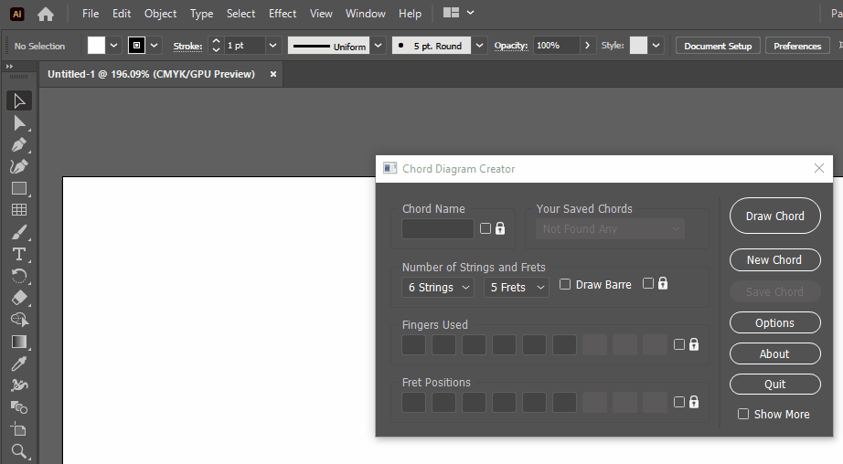
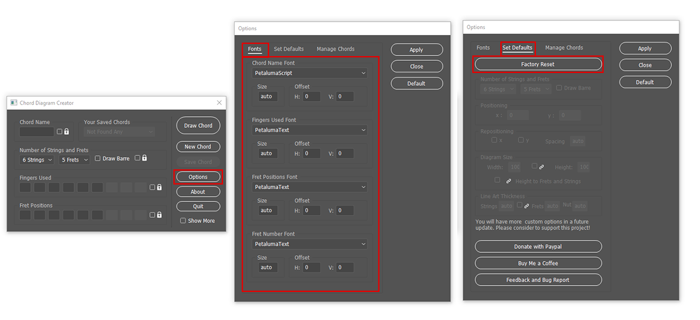
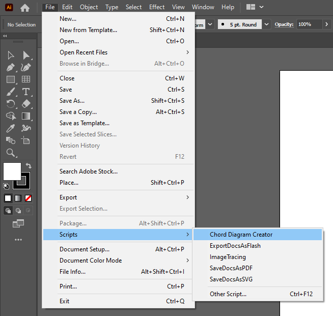

# Chord Diagram Creator 

## for Adobe Illustrator v0.7.1 beta

The "Chord Diagram Creator" is a handy script for Adobe Illustrator that will draw chords for you! Here is a fast demonstration of the most basic functionality.

### Table of Contents

* [Prerequisites](#prerequisites)
* [Recommended Fonts](# Recommended-Fonts)
* [How To install Illustrator Scripts on Windows](# How-To-install-Illustrator-Scripts-on-Windows)
* [How To install Illustrator Scripts on MAC](# How To install Illustrator Scripts on MAC)
* [Road Map](# Road-Map)
* [Support this project](# Support-this-project)

### Prerequisites  

Adobe Illustrator is required to use this script.

### Recommended Fonts

You can use any font you like with the Chord Diagram Creator, as long as it is installed into your computer. However, is recommended to use the [Petaluma music fonts](https://github.com/steinbergmedia/petaluma), licensed under the SIL Open Font License. This license is very permissive to printing. If you have installed those fonts before the first launch, the script will detect them and will use them as the default fonts. If you install those fonts after launching the script for the first time, then you can either set them manually in Options -> Fonts Tab, or by pressing the button [Factory Reset] in Options -> Set Defaults Tab.

### How To install Illustrator Scripts on **Windows**

1. Download the ChordDiagramCreator.zip file from the [latest release](https://github.com/harpwood/Chord-Diagram-Creator-for-Adobe-Illustrator/releases) of the script and unzip it.
2. Copy and paste the 'Chord Diagram Creator.jsx' in the folder '[Adobe Illustrator Installation folder]\Presets\\[Language]\Scripts'. An example path could be 'C:\Program Files\Adobe\Adobe Illustrator 2020\Presets\en_US\Scripts'.
3. If Adobe Illustrator is open, you should close and restart. After restart you will find the script in the Main Menu of Adobe Illustrator File -> Scripts -> Chord Diagram Creator.

### How To install Illustrator Scripts on **MAC**

1. Download the ChordDiagramCreator.zip file from the [latest release](https://github.com/harpwood/Chord-Diagram-Creator-for-Adobe-Illustrator/releases) of the script and unzip it.

2. Copy and paste the 'Chord Diagram Creator.jsx' in the folder 'Applications>Adobe  Illustrator>Presets>en_US>Scripts'.

3. If Adobe Illustrator is open, you should close and restart. After restart you will find the script in the Main Menu of Adobe Illustrator File -> Scripts -> Chord Diagram Creator.

   

### Road Map

- Finishing the documentation
- Adding the ability to customize the default settings.
- Adding the ability to save and load your chords
- Adding the ability to manage your saved chords as a chord library.

##### You can help me implement those feature by supporting me in various ways.

### Support this project

Together we can make the Chord Diagram Creator better! 

- You can give feedback, suggestions and bugs reports on the [Issue page](https://github.com/harpwood/Chord-Diagram-Creator-for-Adobe-Illustrator/issues).
- [Buy me a coffee](https://www.buymeacoffee.com/harpwood)
- [Donate with PayPal](https://www.paypal.me/GeorgeKritikos).

